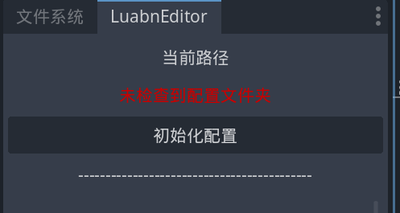
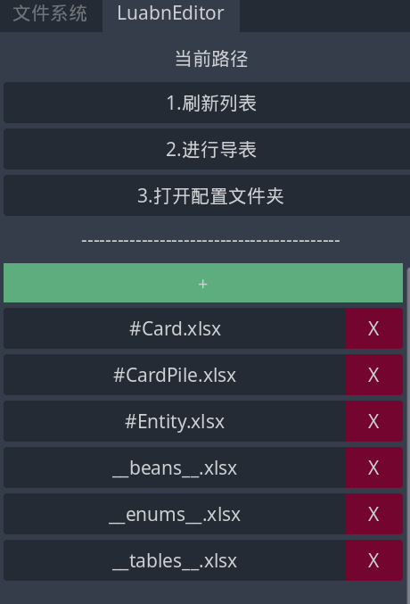
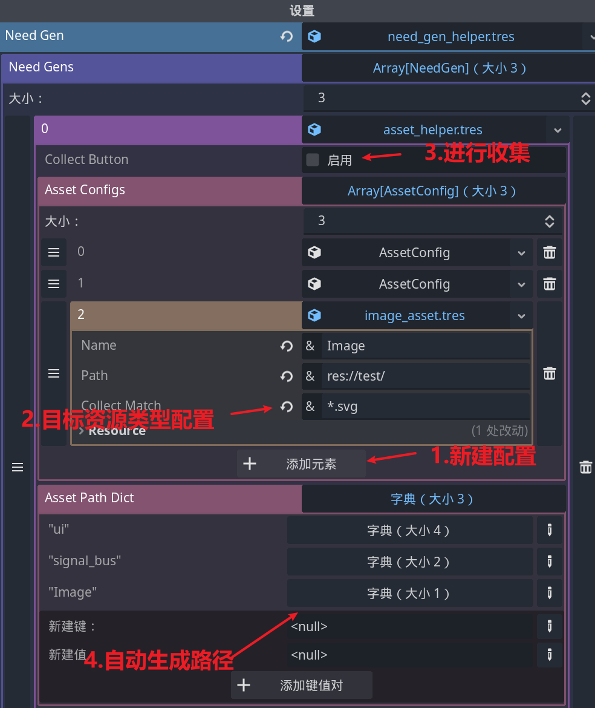
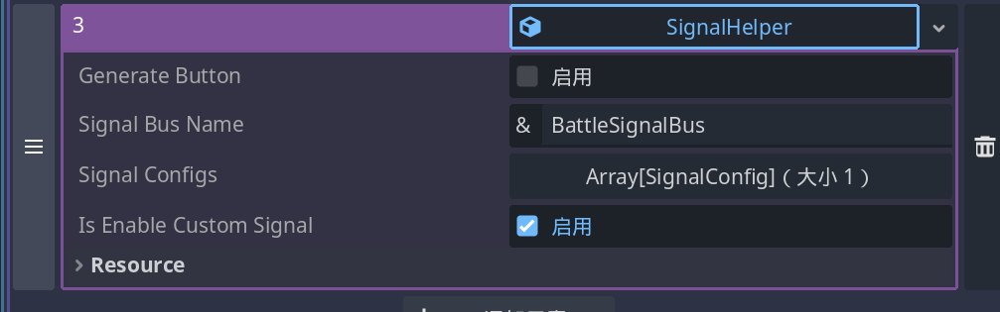
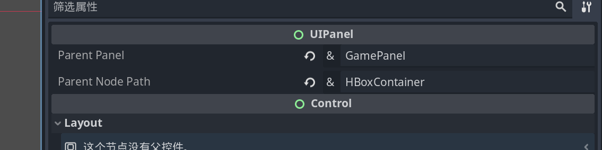

# Godot项目的框架

用于godot项目的快速启动的框架，实现了一些常用功能，并为Luban实现了一个插件。

## HydrcatFramework

## 1.LubanEditor



### 配置及使用
> 该插件需要python3环境

第一次使用时点击`初始化配置`，编辑器将复制`res://addons/luban_godot/template_folder`下的文件到`res://_excel`下进行初始化。



### 特性
- 目标代码生成为独立的gd文件
- godot内快速的对excel进行增删改
- 其他Luban实现的特性，见luban文档->https://luban.doc.code-philosophy.com/

## 2. 资源管理器
基于资源名的资源管理器，并不优雅，也不有效，只是适合我自己。
### 配置及使用

找到框架入口`res://framework/hydrcat_framework.tscn` 进行配置



然后就可以在脚本中使用类似如下脚本加载资源
```
# 加载资源
var res :=  HydrcatFramework.asset_manager.load_asset("Image","icon")

# ！需要注意，asset_manager不会返回最终资源的类型，只会返回Resource
var icon : Texture = res
```

## 3. 信号总线管理器
godot中常常使用一个单例管理游戏中的各个信号，然而将所有的信号都放在一个单例中显然是不合理的。
基于此，设计了一个没卵用的生成信号总线的工具



比较有意思的是，SignalBus 的继承关系为
> SignalBus <- SignalBusCustom <- ManagerBase
其中SignalBus为代码生成文件，而SignalBusCustom提供给开发者自定义，不会因为自动生成被替换，通过这种模式保留了一定自由。

## 4. 对象池
其实应该称作`节点池`,最小管理单元为**存在`PoolNodeComponent`子节点的任意节点**，推荐打包为`PackedScene`。
```
# 节点池部分
## 注册节点池
var bullet_ps : PackedScene = HydrcatFramework.asset_manager.load_asset("PackedScene","bullet")
var bullet_pool := HydrcatFramewrok.pool_manger.register_pool("bullet", bullet_ps,50)

## 唤醒并取出节点
var bullet : Node = bullet_pool.awake_object()

# 节点部分
extend PoolNodeComponent

func _on_awake() -> void:
	# 重置子弹位置，并发射子弹

func _on_sleep() -> void:
	# 关闭子弹物理，隐藏子弹，冻结子弹
```
## 5. UI管理器
`Panel`作为UI的核心，所有的UI都是Panel的嵌套。
Panel指继承`UIPanel` 并保存为“xxxpanel”的的PackedScene

保存为PackedScene后，配置目标的父Panel和相对位置，即可在代码中简单的使用类似如下代码打开Panel
```
extend UIPanel
open_panel("PanelName")

```

